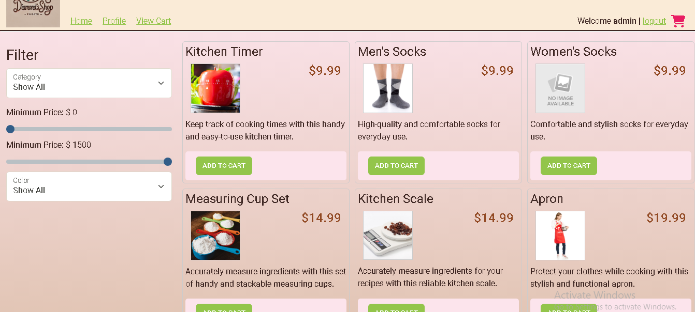

Welcome to EasyShop, the ultimate shopping assistant! This project makes your shopping experience seamless and stress-free. Let's dive in! 🛒✨

## **🎯 Features**
* 🛍️ User-friendly Interface: Easy and intuitive shopping experience.
* 🔍 Smart Search: Quickly find what you're looking for.
* 📊 Analytics: Get insights on your shopping habits.
* 💸 Budget Tracking: Keep track of your spending and stay within budget.
* 📅 Wishlist and Reminders: Never miss out on a great deal!

## **🚀 Usage**

* Open the application.
* Browse or search for products.
* Add items to your cart or wishlist.
* Enjoy a seamless shopping experience!

## **🖥️ Tech Usage**

* Java programming language
* Spring Boot Framework
* MySQL Database
* Maven Dependency management

## **🛠️ Bug Fixing**

* Identifying the bugs using error messages and failed tests.
* Debugging the code using different resources and learned skills to correct the errors.
* Fixing the code by implementing new codes and annotations to get a running code.
